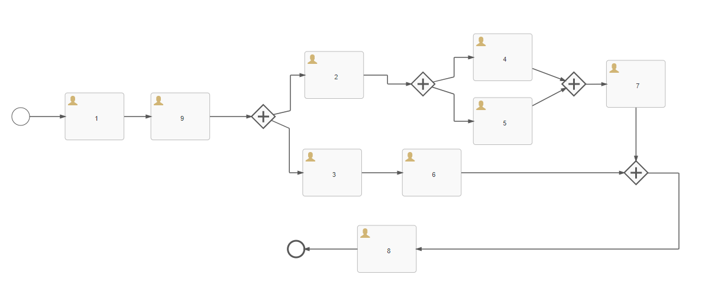
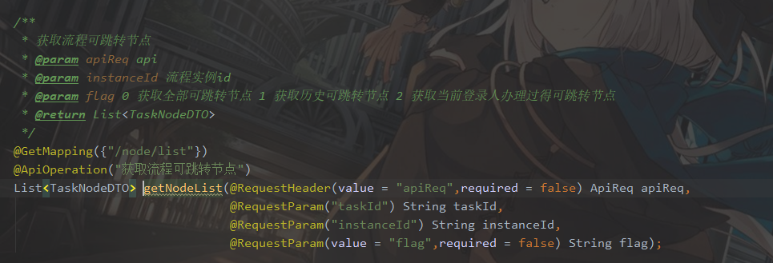
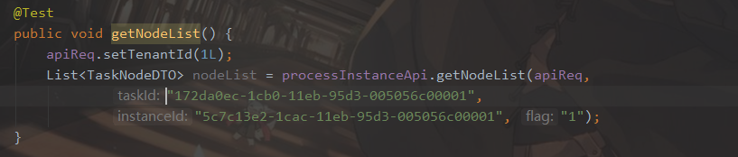
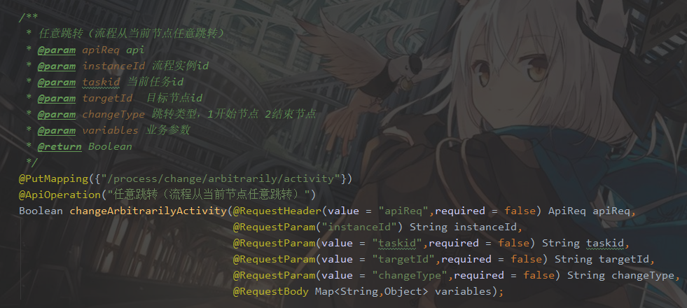
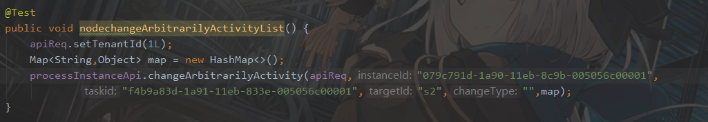

# IBPM任务任意跳转

##### 简介：即当前任务可任意跳转，但是我们还是做出了一些限制。比如：在并行网关内向前进行跳转或普通网关直接向网关内跳转，则违反了并行网关流程的原则。所以现在的任意跳转只能对已经办理过的流程（不能往并行网关内跳转，任务可以从并行网关内跳出，但不能跳入并行网关）进行跳转。

### 以下将按照下图作为例子，给出示例和用法：

> 如上图所示，如果想要进行任意跳转，则我们需要知道任务所处位置能够往哪些位置上跳转。
>
> 例：当任务处在任务9时，那么只能往任务1进行跳转；任务处在4时，则可以往任务1、9、2进行跳转，当任务处在任务7时，则也只能往任务1、9、2进行跳转。

### 任意跳转需要用的接口如下：

### 1.获取流程可跳转节点

##### 接口定义如下：

<table style="text-align:center">
    <tr bgcolor="yellow">
        <td style="width:12%">接口名称</td>
        <td style="width:17%">接口调用方式</td>
        <td style="width:12%">参数</td>
        <td style="width:12%">能否为空</td>
        <td>参数含义</td>
    </tr>
    <tr>
        <td rowspan="7">获取可跳转节点</td>
        <td rowspan="7">GET</td>
    </tr>
    <tr>
        <td>ApiReq</td>
        <td>否</td>
        <td style="text-align:left">系统必传请求参数</td>
    </tr>
    <tr>
        <td>taskId</td>
        <td>否</td>
        <td style="text-align:left">当前任务Id</td>
    </tr>
    <tr>
        <td>instanceId</td>
        <td>否</td>
        <td style="text-align:left">流程实例Id</td>
    </tr>
    <tr>
        <td>flag</td>
        <td>否</td>
        <td style="text-align:left">传入值为1时，获取历史可跳转节点。传入值为2时，获取当前登录人办理过得可跳转节点。
        </td>
    </tr>
</table>

> 代码示例：

上图接口可获取到当前任务可跳转的任务节点。

### 2.任意跳转接口

##### 接口定义如下：

###### 注意：targetId和changeType有且只能有一个值。即当changeType不为空时，targetId必须为空。反之targetId不为空时，changeType必须为空

<table style="text-align:center">
    <tr bgcolor="yellow">
        <td style="width:12%">接口名称</td>
        <td style="width:17%">接口调用方式</td>
        <td style="width:12%">参数</td>
        <td style="width:12%">能否为空</td>
        <td>参数含义</td>
    </tr>
    <tr>
        <td rowspan="7">任意跳转</td>
        <td rowspan="7">PUT</td>
    </tr>
    <tr>
        <td>ApiReq</td>
        <td>否</td>
        <td style="text-align:left">系统必传请求参数</td>
    </tr>
    <tr>
        <td>instanceId</td>
        <td>否</td>
        <td style="text-align:left">流程实例Id</td>
    </tr>
    <tr>
        <td>taskid</td>
        <td>否</td>
        <td style="text-align:left">任务Id</td>
    </tr>
    <tr>
        <td>targetId</td>
        <td>能</td>
        <td style="text-align:left">需要跳转到某节点的activity_id，
            与changeType只能有一个值不为空
            
        </td>
    </tr>
    <tr>
        <td>changeType</td>
        <td>能</td>
        <td style="text-align:left">为1时代表回到开始节点，为2时代表跳到结束，为空时，根据targetId跳转到对应的任务节点</td>
    </tr>
    <tr>
        <td>variables</td>
        <td>能</td>
        <td style="text-align:left">map类型。业务参数，跳转到某一节点需要参数时使用</td>
    </tr>
</table>

> 代码示例

### 流程示例：[流程文件](./file/dddd.bpmn20.xml)