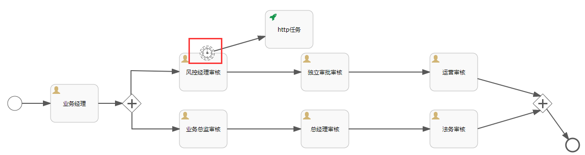
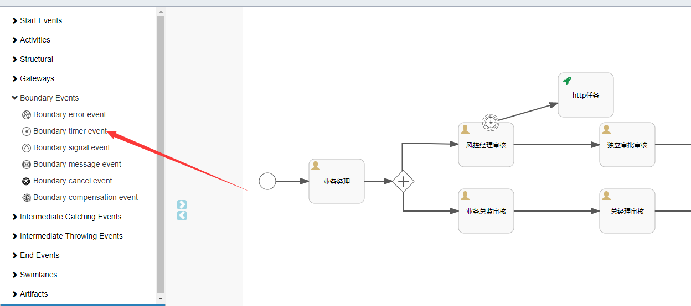
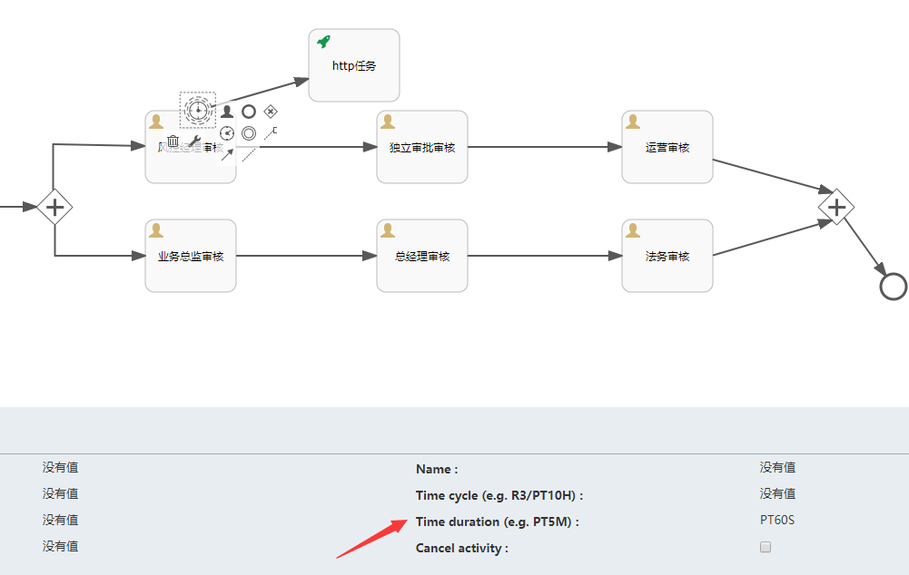
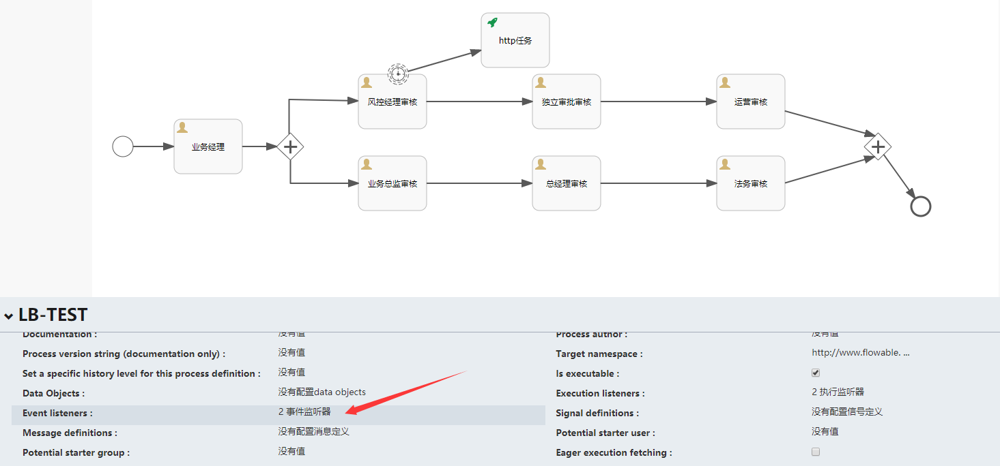
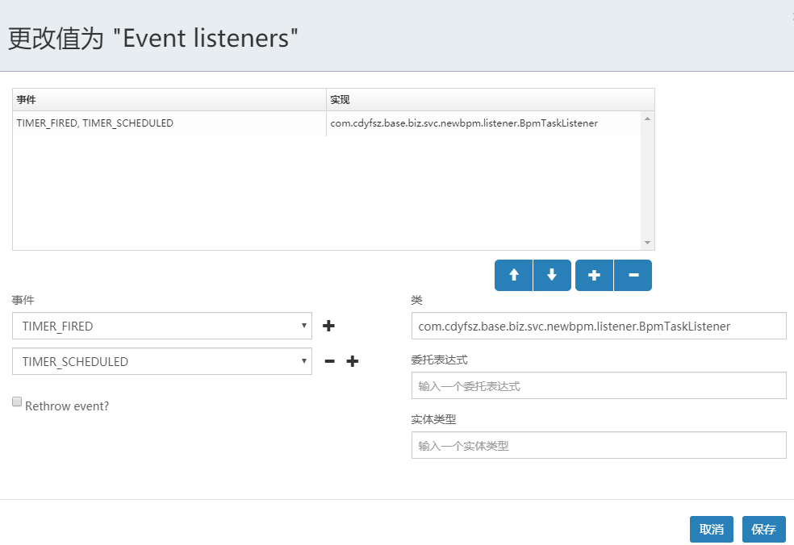
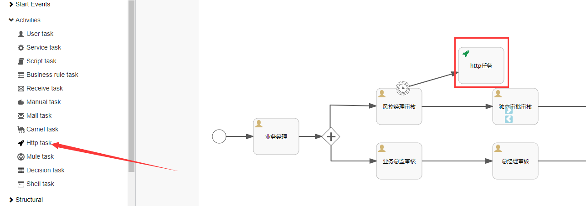
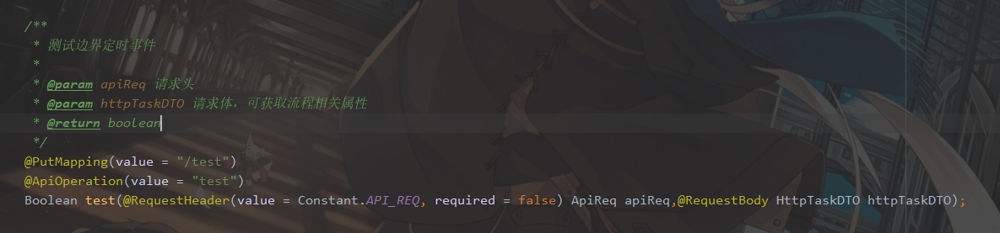
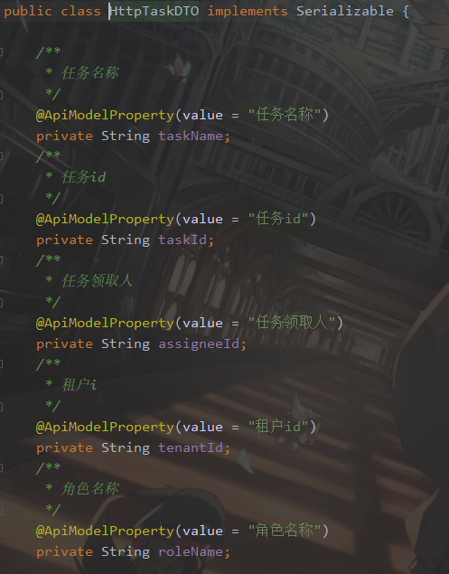

# IBPM任务超时提醒

##### 简介：任务超时提醒，即当某个task任务超过设置时间未完成时会触发某个任务（边界定时事件），可以通过发送邮件、短信等方式来告知用户任务在规定时间内未被处理。

### 1.边界定时事件

> 如下图红框中所示即为边界定时事件



> 当任务到风控经理审核的时候，如果超过设置时间未完成任务则会触发边界定时时间，执行Http任务

### 2.边界定时事件的配置

> 相关属性：

##### 注意：如果勾选了Cancel activity属性，如上图所示，http必须与某个任务以线连接起来，否则风控经理审核这条线的所有流程将会结束。如果与http任务与独立审批审核连接那么http任务结束后任务将会在独立审批审核任务节点上。

| 名称                       | 含义                                                         | 配置示例                             |
| -------------------------- | :----------------------------------------------------------- | ------------------------------------ |
| Time cycle (e.g. R3/PT10H) | 循环执行                                                     | R3/PT10H: 循环3次,每次执行间隔10小时 |
| Time duration (e.g. PT5M)  | 只执行一次                                                   | PT5H: 任务创建5小时后执行            |
| Cancel activity            | 是否结束当前任务标示(如果勾选了那么在触发定时器时会结束当前任务,如下图中,如果勾选,那么在触发定时任务时"第一步"这个任务会结束) |                                      |

##### 2.1、在流程图中添加边界定时事件：拖动图中箭头标识的定时任务到画布中风控经理审核节点上



##### 2.2、设置边界定时事件属性，如下图示例：未设置循环，未结束任务。设置定时时间为60秒



##### 2.3、设置流程事件触发器：如下图点击空白处，选择Event listeners



##### 2.4、设置以下事件：TIMER_FIRED、TIMER_SCHEDULED

##### 对应实现：com.cdyfsz.base.biz.svc.newbpm.listener.BpmTaskListener设置完成后保存



### 3.HTTP任务配置

> 相关属性：

| 名称                  | 含义           | 配置示例                                            |
| --------------------- | -------------- | --------------------------------------------------- |
| Request URL           | 请求URL        | 可配置ul表达式,如 ${http_url},在代码中设置详细值    |
| Request body          | 请求体         | 固定配置: ${http_parameter_body}                    |
| Request method        | 被请求方法类型 | PUT                                                 |
| Request headers       | 请求头         | 可配置ul表达式,如 ${http_header},在代码中设置详细值 |
| Request body encoding | 请求编码格式   | UTF-8                                               |

##### 3.1、在流程图中添加http任务，拖动Http task到画布中使用流程线连接，点击http任务设置如上表所示配置



##### 

##### 3.2、编写测试接口，如下图：



##### 其中HttpTaskDTO引入BPM对应API后即可使用，属性如下图：

	

### 4.代码示例（忽略了启动流程，以下代码默认节点在业务经理节点）

```java
@Test
public void completeTask1() { 
    apiReq.setTenantId(1L);
    Map<String,Object> map = new HashMap<>();
    StringBuilder requestHeaderBuilder = new StringBuilder();    			       
    requestHeaderBuilder.append("Content-Type: ");    
    requestHeaderBuilder.append("application/json;charset='utf-8'" + "\n");   
    requestHeaderBuilder.append("tenantId: ");    
    requestHeaderBuilder.append(apiReq.getTenantId() + "\n");    
    requestHeaderBuilder.append("token: ");   
    requestHeaderBuilder.append(apiReq.getToken()+ "\n");   
    requestHeaderBuilder.append("client: "); 
    requestHeaderBuilder.append("base-biz-svc-asset-assignee-management");    
    map.put("http_header",requestHeaderBuilder);    
    map.put("http_url","http://192.168.137.109:48026/api/newbpm/task/test");   
    taskApi.completeTask(apiReq,"2796e20b-1282-11eb-b826-005056c00001",map);
}
```

##### 完成业务经理节点任务，边界定时任务时间到设置时间后会自动触发，调用完成任务时传入的http_url的值，其中Request body不需要在参数中写入。BPM会自动处理。

### 流程示例：[流程文件](./file/LB-TEST.bpmn20.xml)

