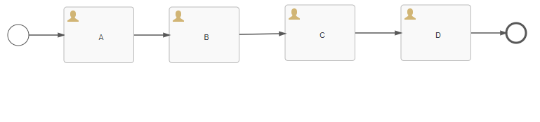
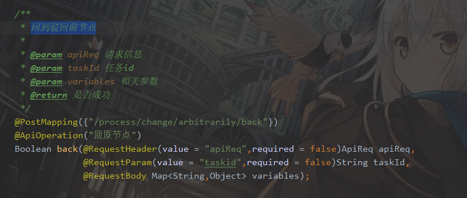

# IBPM任务驳回到指定节点，指定节点完成后回到驳回前节点

### 1.如下图流程中，从D节点驳回到A节点，A节点完成后，流程回到D节点。



### 2.当按照流程图任务走到D节点时调用任意跳转接口，跳转到A节点。


##### 接口定义如下：

###### <span style="color:red">注意：targetId和changeType有且只能有一个值。即当changeType不为空时，targetId必须为空。反之targetId不为空时，changeType必须为空</span>

<table style="text-align:center">
    <tr bgcolor="yellow">
        <td style="width:12%">接口名称</td>
        <td style="width:17%">接口调用方式</td>
        <td style="width:12%">参数</td>
        <td style="width:12%">能否为空</td>
        <td>参数含义</td>
    </tr>
    <tr>
        <td rowspan="7">任意跳转</td>
        <td rowspan="7">PUT</td>
    </tr>
    <tr>
        <td>ApiReq</td>
        <td>否</td>
        <td style="text-align:left">系统必传请求参数</td>
    </tr>
    <tr>
        <td>instanceId</td>
        <td>否</td>
        <td style="text-align:left">流程实例Id</td>
    </tr>
    <tr>
        <td>taskid</td>
        <td>否</td>
        <td style="text-align:left">任务Id</td>
    </tr>
    <tr>
        <td>targetId</td>
        <td>能</td>
        <td style="text-align:left">需要跳转到某节点的activity_id，
            <span style="color:red">与changeType只能有一个值不为空
            </span>
        </td>
    </tr>
    <tr>
        <td>changeType</td>
        <td>能</td>
        <td style="text-align:left">为1时代表回到开始节点，为2时代表跳到结束，为空时，根据targetId跳转到对应的任务节点</td>
    </tr>
    <tr>
        <td>variables</td>
        <td>能</td>
        <td style="text-align:left">map类型。业务参数，跳转到某一节点需要参数时使用</td>
    </tr>
</table>

代码示例：

```java
@Test
public void nodechangeArbitrarilyActivityList() {
    apiReq.setTenantId(1L);    
    processInstanceApi.
        changeArbitrarilyActivity(apiReq,
                                  "97e36328-1299-11eb-b826-005056c00001",
                                  "60d271af-129a-11eb-b826-005056c00001",
                                  "sid-E6DA8F94-BE92-42FD-8D3C-C037B1BC7440",
                                  "",
                                  new HashMap<>());
}
```

### 3.此时流程已经在A节点上。要跳回D节点需调用另一个接口（回原节点）



##### 接口定义如下：

<table style="text-align:center">
    <tr bgcolor="yellow">
        <td style="width:12%">接口名称</td>
        <td style="width:17%">接口调用方式</td>
        <td style="width:12%">参数</td>
        <td style="width:12%">能否为空</td>
        <td>参数含义</td>
    </tr>
    <tr>
        <td rowspan="7">回到原点</td>
        <td rowspan="7">POST</td>
    </tr>
    <tr>
        <td>ApiReq</td>
        <td>否</td>
        <td style="text-align:left">系统必传请求参数</td>
    </tr>
    <tr>
        <td>taskid</td>
        <td>否</td>
        <td style="text-align:left">当前流程所在节点的任务Id</td>
    </tr>
    <tr>
        <td>variables</td>
        <td>能</td>
        <td style="text-align:left">map类型。业务参数，跳转到某一节点需要参数时使用</td>
    </tr>
</table>

代码示例：

```java
@Test
public void back() { 
    apiReq.setTenantId(1L); 
    processInstanceApi.back(apiReq,
                            "a940c5a4-129a-11eb-b826-005056c00001",new HashMap<>());
}
```

### 调用成功后即流程回到D节点。

### 流程示例: [流程文件](./file/lbtest2.bpmn20.xml)

