BPM使用手册


#1、调查任何完成节点的人，选择之前已经做过节点，重新发起流程，对应的画面可操作性内容与之前流程一致

第一步 调用[查询流程任务履历接口](#thistory)获取已完成节点信息

第二步 调用

重新启动流程并完成到某个节点接口：

1.1 请求方法：POST

1.2 地址：/api/newbpm/process/instance/start/and/complete/node

1.3 描述：重新启动流程并完成到某个节点

1.4 请求参数：
	
参数名称|中文名|类型|是否必传|说明
-|-|-|-
apiReq|请求信息|ApiReq|是|系统请求参数
instanceId|流程实例ID|String|是|流程实例ID
id|流程节点ID|String|是|body  需要到的某个节点ID
name|流程节点名称|String|是|body 需要到的某个节点名称

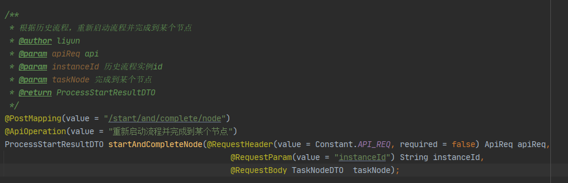

1.5 返回信息

参数名称|中文名|类型|是否必传|说明
-|-|-|-
processDefinitionId|流程定义ID|String|是|流程定义ID
processDefinitionName|流程定义名称|String|是|流程定义名称
bizId|业务ID|String|是|业务ID
processInstanceId|流程实例ID|String|是|流程实例ID
startTime|开始时间|String|是|开始时间

1.6 示例

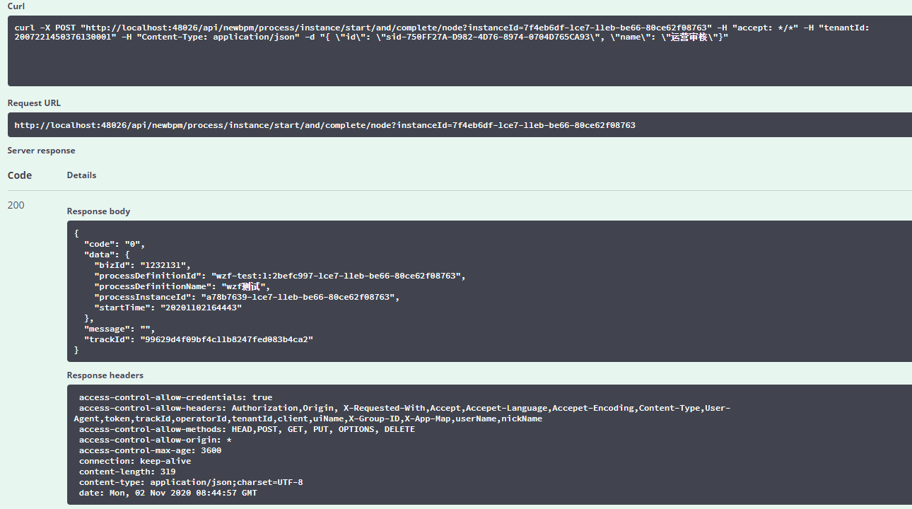

#2、查看流程图

流程实例图接口：

2.1 请求方法：GET

2.2 地址：/api/newbpm/process/definition/running/flowchart

2.3 描述：加载运行中的流程实例图

2.4 请求参数：

参数名称|中文名|类型|是否必传|说明
-|-|-|-
apiReq|请求信息|ApiReq|是|系统请求参数
instanceId|流程实例ID|String|是|流程实例ID

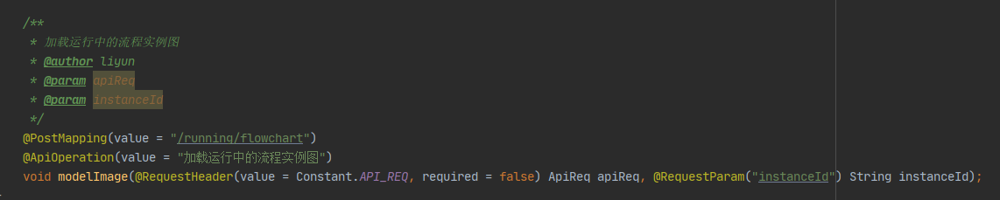


2.5 返回信息  流程图

	
#3、流程审核时间戳履历  

<span id="thistory">查询流程任务履历接口：</span>

3.1 请求方法：GET

3.2 地址：/api/newbpm/task/history

3.3 描述：查询流程以完成任务履历

3.4 请求参数：

参数名称|中文名|类型|是否必传|说明
-|-|-|-
apiReq|请求信息|ApiReq|是|系统请求参数
instanceId|流程实例ID|String|是|流程实例ID


3.5 返回信息

参数名称|中文名|类型|是否必传|说明
-|-|-|-
id|任务id|String|是|任务id
processInstanceId|流程实例id|String|是|流程实例id
taskDefinitionKey|任务节点定义ID|String|是|任务节点定义ID
name|任务名称|String|是|任务名称
assignee|任务领取人|String|是|任务领取人
startTime|开始时间|Date|是|开始时间
claimTime|签收时间|Date|是|签收时间
endTime|结束时间|Date|是|结束时间
tenantId|租户id|String|是|租户id
durationInMillis|耗时|Long|是|耗时


3.6 示例

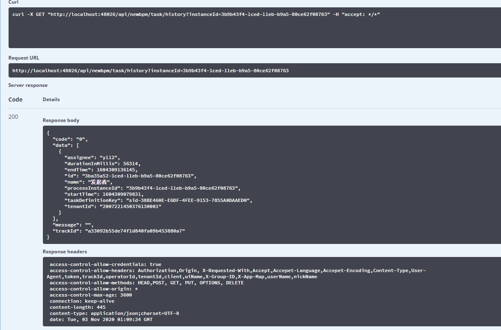

#4、客户自己修改流程后直接发布（仅限于简单的判断项的修改），原有流程的版本保存

flowable-modeler集成地址  服务Ip:端口/flowable/index.html#/processes

iframe集成    参数：tenantId 租户ID

如：http://localhost:48026/flowable/index.html#/processes?tenantId=2004291633263010001

modeler集成页面


点击需修改流程的流程


流程浏览界面


点击可视化编辑修改流程


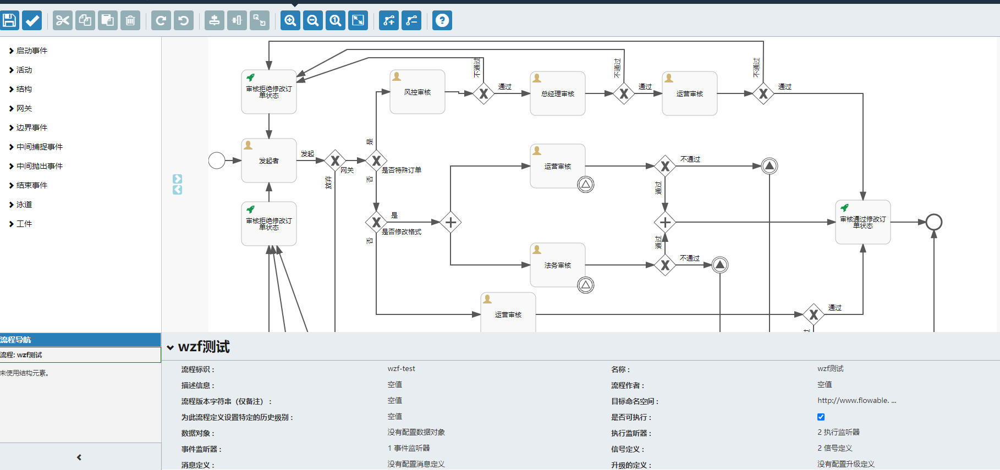

点击发布按钮发布流程

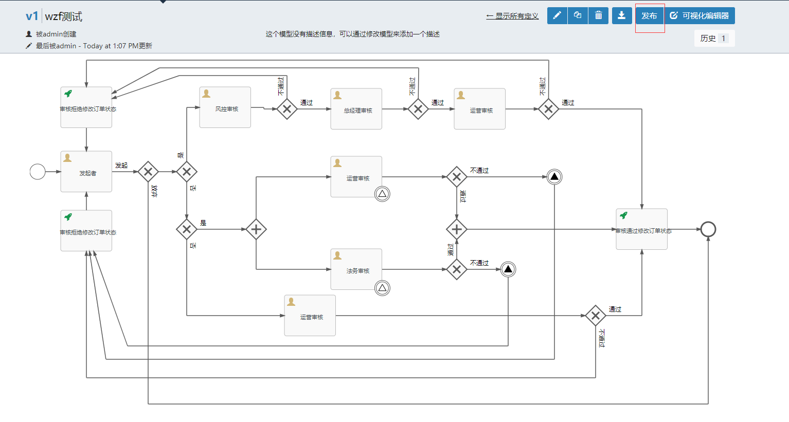


# 5、IBPM任务超时提醒

##### 简介：任务超时提醒，即当某个task任务超过设置时间未完成时会触发某个任务（边界定时事件），可以通过发送邮件、短信等方式来告知用户任务在规定时间内未被处理。

### 5.1.边界定时事件

> 如下图红框中所示即为边界定时事件


> 当任务到风控经理审核的时候，如果超过设置时间未完成任务则会触发边界定时时间，执行Http任务

### 5.2.边界定时事件的配置

> 相关属性：

##### 注意：如果勾选了Cancel activity属性，如上图所示，http必须与某个任务以线连接起来，否则风控经理审核这条线的所有流程将会结束。如果与http任务与独立审批审核连接那么http任务结束后任务将会在独立审批审核任务节点上。

| 名称                       | 含义                                                         | 配置示例                             |
| -------------------------- | :----------------------------------------------------------- | ------------------------------------ |
| Time cycle (e.g. R3/PT10H) | 循环执行                                                     | R3/PT10H: 循环3次,每次执行间隔10小时 |
| Time duration (e.g. PT5M)  | 只执行一次                                                   | PT5H: 任务创建5小时后执行            |
| Cancel activity            | 是否结束当前任务标示(如果勾选了那么在触发定时器时会结束当前任务,如下图中,如果勾选,那么在触发定时任务时"第一步"这个任务会结束) |                                      |

##### 5.2.1、在流程图中添加边界定时事件：拖动图中箭头标识的定时任务到画布中风控经理审核节点上


##### 5.2.2、设置边界定时事件属性，如下图示例：未设置循环，未结束任务。设置定时时间为60秒

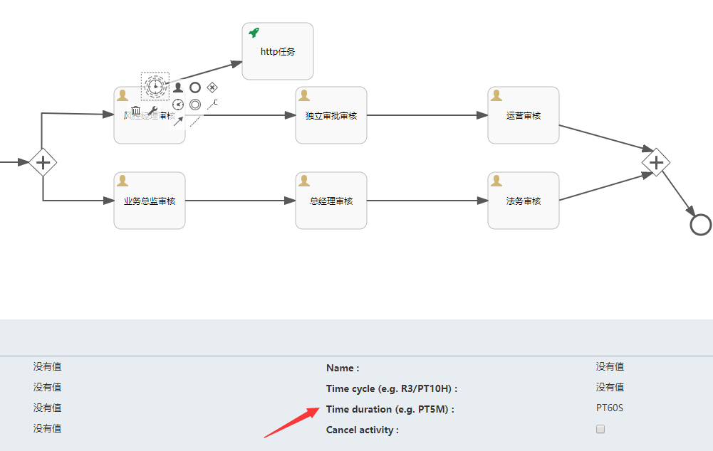

##### 5.2.3、设置流程事件触发器：如下图点击空白处，选择Event listeners


##### 5.2.4、设置以下事件：TIMER_FIRED、TIMER_SCHEDULED

##### 对应实现：com.cdyfsz.base.biz.svc.newbpm.listener.BpmTaskListener设置完成后保存


### 5.3.HTTP任务配置

> 相关属性：

| 名称                  | 含义           | 配置示例                                            |
| --------------------- | -------------- | --------------------------------------------------- |
| Request URL           | 请求URL        | 可配置ul表达式,如 ${http_url},在代码中设置详细值    |
| Request body          | 请求体         | 固定配置: ${http_parameter_body}                    |
| Request method        | 被请求方法类型 | PUT                                                 |
| Request headers       | 请求头         | 可配置ul表达式,如 ${http_header},在代码中设置详细值 |
| Request body encoding | 请求编码格式   | UTF-8                                               |

##### 5.3.1、在流程图中添加http任务，拖动Http task到画布中使用流程线连接，点击http任务设置如上表所示配置


##### 

##### 5.3.2、编写测试接口，如下图：


##### 其中HttpTaskDTO引入BPM对应API后即可使用，属性如下图：

	

### 5.4.代码示例（忽略了启动流程，以下代码默认节点在业务经理节点）

```java
@Test
public void completeTask1() { 
    apiReq.setTenantId(1L);
    Map<String,Object> map = new HashMap<>();
    StringBuilder requestHeaderBuilder = new StringBuilder();    			       
    requestHeaderBuilder.append("Content-Type: ");    
    requestHeaderBuilder.append("application/json;charset='utf-8'" + "\n");   
    requestHeaderBuilder.append("tenantId: ");    
    requestHeaderBuilder.append(apiReq.getTenantId() + "\n");    
    requestHeaderBuilder.append("token: ");   
    requestHeaderBuilder.append(apiReq.getToken()+ "\n");   
    requestHeaderBuilder.append("client: "); 
    requestHeaderBuilder.append("base-biz-svc-asset-assignee-management");    
    map.put("http_header",requestHeaderBuilder);    
    map.put("http_url","http://192.168.137.109:48026/api/newbpm/task/test");   
    taskApi.completeTask(apiReq,"2796e20b-1282-11eb-b826-005056c00001",map);
}
```

##### 完成业务经理节点任务，边界定时任务时间到设置时间后会自动触发，调用完成任务时传入的http_url的值，其中Request body不需要在参数中写入。BPM会自动处理。

### 流程示例：[流程文件](./file/LB-TEST.bpmn20.xml)


# 6、IBPM任务任意跳转

##### 简介：即当前任务可任意跳转，但是我们还是做出了一些限制。比如：在并行网关内向前进行跳转或普通网关直接向网关内跳转，则违反了并行网关流程的原则。所以现在的任意跳转只能对已经办理过的流程（<span style= "color:red">不能往并行网关内跳转，任务可以从并行网关内跳出，但不能跳入并行网关</span>）进行跳转。

### 以下将按照下图作为例子，给出示例和用法：

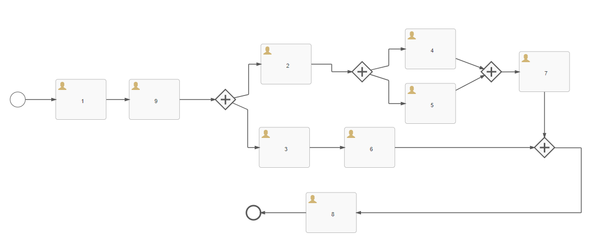

> 如上图所示，如果想要进行任意跳转，则我们需要知道任务所处位置能够往哪些位置上跳转。
>
> 例：当任务处在任务9时，那么只能往任务1进行跳转；任务处在4时，则可以往任务1、9、2进行跳转，当任务处在任务7时，则也只能往任务1、9、2进行跳转。

### 任意跳转需要用的接口如下：

### 6.1.获取流程可跳转节点


##### 接口定义如下：

<table style="text-align:center">
    <tr bgcolor="yellow">
        <td style="width:12%">接口名称</td>
        <td style="width:17%">接口调用方式</td>
        <td style="width:12%">参数</td>
        <td style="width:12%">能否为空</td>
        <td>参数含义</td>
    </tr>
    <tr>
        <td rowspan="7">获取可跳转节点</td>
        <td rowspan="7">GET</td>
    </tr>
    <tr>
        <td>ApiReq</td>
        <td>否</td>
        <td style="text-align:left">系统必传请求参数</td>
    </tr>
    <tr>
        <td>taskId</td>
        <td>否</td>
        <td style="text-align:left">当前任务Id</td>
    </tr>
    <tr>
        <td>instanceId</td>
        <td>否</td>
        <td style="text-align:left">流程实例Id</td>
    </tr>
    <tr>
        <td>flag</td>
        <td>否</td>
        <td style="text-align:left">传入值为1时，获取历史可跳转节点。传入值为2时，获取当前登录人办理过得可跳转节点。
        </td>
    </tr>
</table>

> 代码示例：


上图接口可获取到当前任务可跳转的任务节点。

### 6.2.任意跳转接口


##### 接口定义如下：

###### <span style="color:red">注意：targetId和changeType有且只能有一个值。即当changeType不为空时，targetId必须为空。反之targetId不为空时，changeType必须为空</span>

<table style="text-align:center">
    <tr bgcolor="yellow">
        <td style="width:12%">接口名称</td>
        <td style="width:17%">接口调用方式</td>
        <td style="width:12%">参数</td>
        <td style="width:12%">能否为空</td>
        <td>参数含义</td>
    </tr>
    <tr>
        <td rowspan="7">任意跳转</td>
        <td rowspan="7">PUT</td>
    </tr>
    <tr>
        <td>ApiReq</td>
        <td>否</td>
        <td style="text-align:left">系统必传请求参数</td>
    </tr>
    <tr>
        <td>instanceId</td>
        <td>否</td>
        <td style="text-align:left">流程实例Id</td>
    </tr>
    <tr>
        <td>taskid</td>
        <td>否</td>
        <td style="text-align:left">任务Id</td>
    </tr>
    <tr>
        <td>targetId</td>
        <td>能</td>
        <td style="text-align:left">需要跳转到某节点的activity_id，
            <span style="color:red">与changeType只能有一个值不为空
            </span>
        </td>
    </tr>
    <tr>
        <td>changeType</td>
        <td>能</td>
        <td style="text-align:left">为1时代表回到开始节点，为2时代表跳到结束，为空时，根据targetId跳转到对应的任务节点</td>
    </tr>
    <tr>
        <td>variables</td>
        <td>能</td>
        <td style="text-align:left">map类型。业务参数，跳转到某一节点需要参数时使用</td>
    </tr>
</table>

> 代码示例


### 流程示例：[流程文件](./file/dddd.bpmn20.xml)


> # 7、IBPM任务驳回到指定节点，指定节点完成后回到驳回前节点
> 
> ### 7.1.如下图流程中，从D节点驳回到A节点，A节点完成后，流程回到D节点。
> 
> 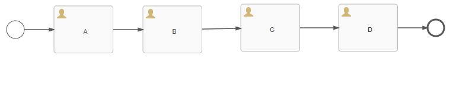
> 
> ### 7.2.当按照流程图任务走到D节点时调用任意跳转接口，跳转到A节点。
> 
> 
> 
> ##### 接口定义如下：
> 
> ###### <span style="color:red">注意：targetId和changeType有且只能有一个值。即当changeType不为空时，targetId必须为空。反之targetId不为空时，changeType必须为空</span>
> 
> <table style="text-align:center">
>     <tr bgcolor="yellow">
>         <td style="width:12%">接口名称</td>
>         <td style="width:17%">接口调用方式</td>
>         <td style="width:12%">参数</td>
>         <td style="width:12%">能否为空</td>
>         <td>参数含义</td>
>     </tr>
>     <tr>
>         <td rowspan="7">任意跳转</td>
>         <td rowspan="7">PUT</td>
>     </tr>
>     <tr>
>         <td>ApiReq</td>
>         <td>否</td>
>         <td style="text-align:left">系统必传请求参数</td>
>     </tr>
>     <tr>
>         <td>instanceId</td>
>         <td>否</td>
>         <td style="text-align:left">流程实例Id</td>
>     </tr>
>     <tr>
>         <td>taskid</td>
>         <td>否</td>
>         <td style="text-align:left">任务Id</td>
>     </tr>
>     <tr>
>         <td>targetId</td>
>         <td>能</td>
>         <td style="text-align:left">需要跳转到某节点的activity_id，
>             <span style="color:red">与changeType只能有一个值不为空
>             </span>
>         </td>
>     </tr>
>     <tr>
>         <td>changeType</td>
>         <td>能</td>
>         <td style="text-align:left">为1时代表回到开始节点，为2时代表跳到结束，为空时，根据targetId跳转到对应的任务节点</td>
>     </tr>
>     <tr>
>         <td>variables</td>
>         <td>能</td>
>         <td style="text-align:left">map类型。业务参数，跳转到某一节点需要参数时使用</td>
>     </tr>
> </table>
> 
> 代码示例：
> 
> ```java
> @Test
> public void nodechangeArbitrarilyActivityList() {
>     apiReq.setTenantId(1L);    
>     processInstanceApi.
>         changeArbitrarilyActivity(apiReq,
>                                   "97e36328-1299-11eb-b826-005056c00001",
>                                   "60d271af-129a-11eb-b826-005056c00001",
>                                   "sid-E6DA8F94-BE92-42FD-8D3C-C037B1BC7440",
>                                   "",
>                                   new HashMap<>());
> }
> ```
> 
> ### 7.3.此时流程已经在A节点上。要跳回D节点需调用另一个接口（回原节点）
> 
> 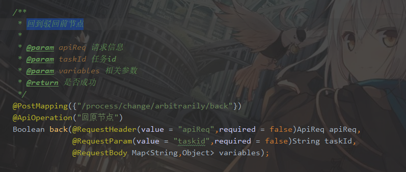
> 
> ##### 接口定义如下：
> 
> <table style="text-align:center">
>     <tr bgcolor="yellow">
>         <td style="width:12%">接口名称</td>
>         <td style="width:17%">接口调用方式</td>
>         <td style="width:12%">参数</td>
>         <td style="width:12%">能否为空</td>
>         <td>参数含义</td>
>     </tr>
>     <tr>
>         <td rowspan="7">回到原点</td>
>         <td rowspan="7">POST</td>
>     </tr>
>     <tr>
>         <td>ApiReq</td>
>         <td>否</td>
>         <td style="text-align:left">系统必传请求参数</td>
>     </tr>
>     <tr>
>         <td>taskid</td>
>         <td>否</td>
>         <td style="text-align:left">当前流程所在节点的任务Id</td>
>     </tr>
>     <tr>
>         <td>variables</td>
>         <td>能</td>
>         <td style="text-align:left">map类型。业务参数，跳转到某一节点需要参数时使用</td>
>     </tr>
> </table>
> 
> 代码示例：
> 
> ```java
> @Test
> public void back() { 
>     apiReq.setTenantId(1L); 
>     processInstanceApi.back(apiReq,
>                             "a940c5a4-129a-11eb-b826-005056c00001",new HashMap<>());
> }
> ```
> 
> ### 调用成功后即流程回到D节点。
> 
 流程示例: [流程文件](./file/lbtest2.bpmn20.xml)

# 8、IBPM节点任务委派

##### 简介：如图1.0.1为例当任务在未结束前任意节点时，可将任务委派给其他人。假如当任务处在业务经理节点时，这时候业务经理A领取了任务，然后把任务委派给了业务经理B。这时候业务经理A无法完成该任务，只有业务经理B完成委派任务后，任务会自动回来业务经理A，由业务经理A继续推动流程。

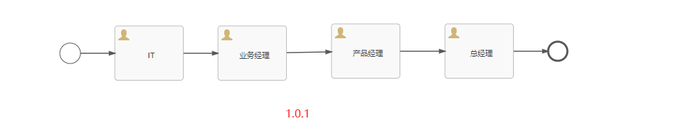

 示例：当任务处在业务经理处，业务经理A领取后，任务转派给业务经理B或其他人时，需要调用如下接口

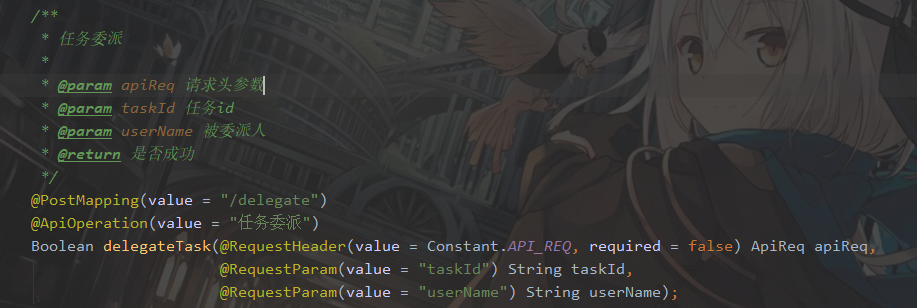

 接口定义如下：

<table style="text-align:center">
    <tr bgcolor="yellow">
        <td style="width:12%">接口名称</td>
        <td style="width:17%">接口调用方式</td>
        <td style="width:12%">参数</td>
        <td style="width:12%">能否为空</td>
        <td>参数含义</td>
    </tr>
    <tr>
        <td rowspan="7">回到原点</td>
        <td rowspan="7">POST</td>
    </tr>
    <tr>
        <td>ApiReq</td>
        <td>否</td>
        <td style="text-align:left">系统必传请求参数</td>
    </tr>
    <tr>
        <td>taskid</td>
        <td>否</td>
        <td style="text-align:left">当前流程所在节点的任务Id</td>
    </tr>
    <tr>
        <td>userName</td>
        <td>否</td>
        <td style="text-align:left">被委派人信息。</td>
    </tr>
</table>

 代码示例：


##### 调用完成后即任务被指派给指定用户。被指派人调用完成任务接口即可完成指派任务。


完成后由业务经理A即可继续推进流程。

流程示例：[流程文件](./file/lbtest4.bpmn20.xml)

 


 


